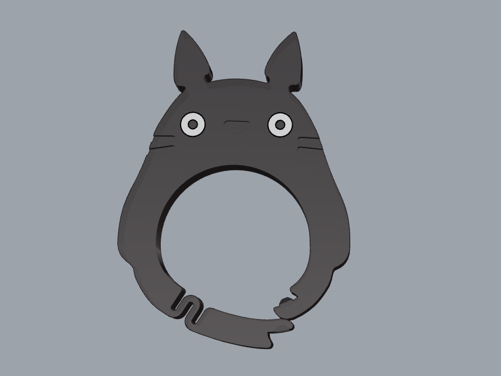
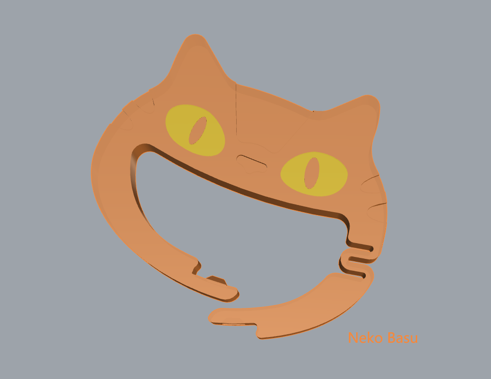
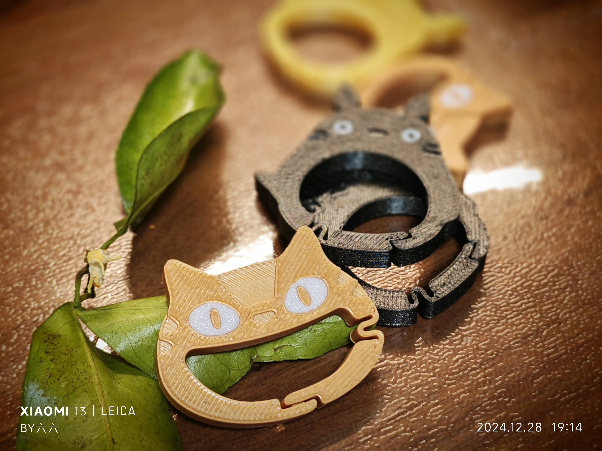
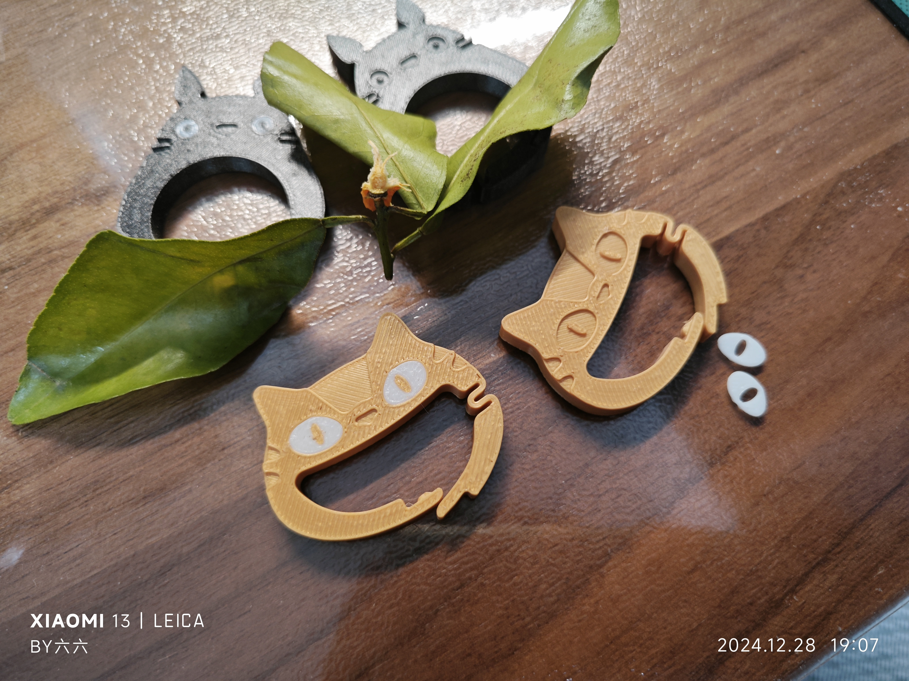
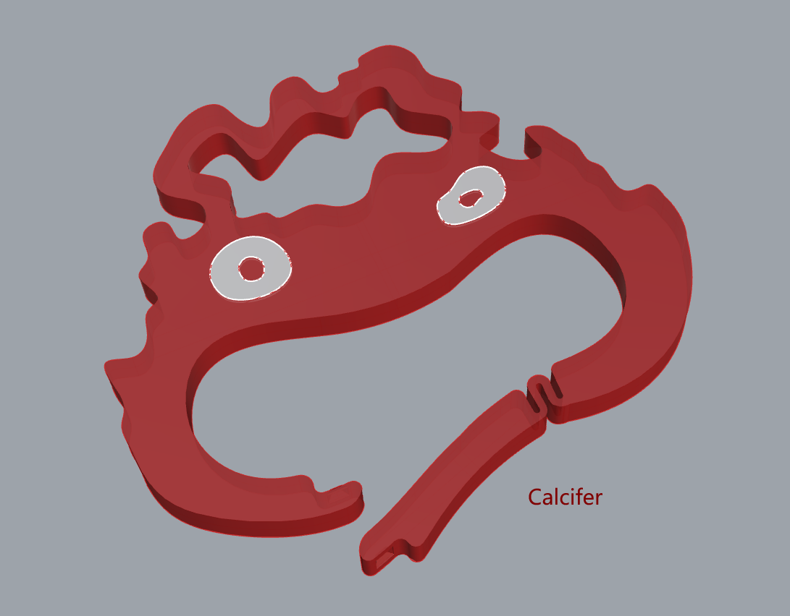
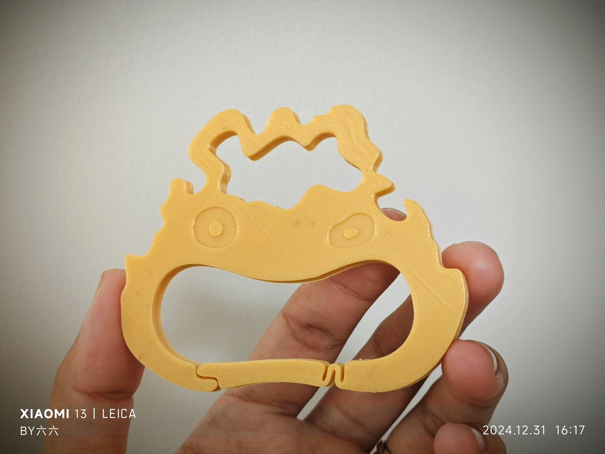

# Carabiner Project

This repository provides 3D models for carabiners. To improve strength and durability, it is recommended to use PETG material for printing, as PLA is more prone to breaking under pressure.

## Models

- **Totoro Carabiner**: A 3D model of a carabiner shaped like Totoro.
  - `totoro.stl`: Standard single-color model, base part of Totoro.
  - `totoro-eyes.stl`: Standard single-color model, eyes part of Totoro.
  - `totoro-ams.stl`: Multi-color version of the Totoro carabiner model.
  - `totoro.3mf`: 3MF file of the standard Totoro model.
  - `totoro-ams.3mf`: 3MF file of the multi-color Totoro model.

- **Neko Basu Carabiner**: A 3D model of a carabiner shaped like Neko Basu.
  - `Nekobasu.stl`: Standard single-color model, base part of Neko Basu.
  - `Nekobasu-eyes.stl`: Standard single-color model, eyes part of Neko Basu.
  - `Nekobasu-ams.stl`: Multi-color version of the Neko Basu carabiner model.
  - `Nekobasu.3mf`: 3MF file of the standard Neko Basu model.
  - `Nekobasu-ams.3mf`: 3MF file of the multi-color Neko Basu model.

- **Calcifer Carabiner**: A 3D model of a carabiner shaped like Calcifer.
  - `Calcifer.stl`: Standard single-color model, base part of Calcifer.
  - `Calcifer-eyes.stl`: Standard single-color model, eyes part of Calcifer.
  - `Calcifer-ams.stl`: Multi-color version of the Calcifer carabiner model.
  - `Calcifer.3mf`: 3MF file of the standard Calcifer model.
  - `Calcifer-ams.3mf`: 3MF file of the multi-color Calcifer model.

## Printing Recommendations

- **Material**: PETG is recommended for printing as it is stronger and more durable than PLA. PLA is more prone to breaking under pressure, making PETG a better choice for functional prints like carabiners.
- **Printer Settings**: Ensure appropriate temperature settings for PETG to achieve optimal adhesion and strength. It is recommended to use a printer with a heated bed.
- **Multi-color Printing**: The `-ams` versions of the models are designed for multi-color printing. If you have a multi-material printer, these files will allow you to print multi-color carabiners.
- **Single-color Printing**: The models in the `single-color/` folder are designed for single-color printing. Parts requiring different colors are placed on separate plates for easy printing.

## Usage Recommendations

- These carabiner models are intended for everyday use and are not suitable for high-risk activities, such as work at heights. Due to the strength limitations of 3D printed materials, please follow safety guidelines when using these models.
- The `.stl` files are compatible with most slicing software for customizing your carabiner prints.
- The `.3mf` files are pre-configured for easy printing and can be opened directly in Orca or Bambu Studio.
- Before printing, please test the model to ensure proper fit and strength.

## Future Models

More creative and functional carabiner designs will be added in the future. Stay tuned for updates.

## License

This project is licensed under the [Creative Commons Attribution 4.0 International License](https://creativecommons.org/licenses/by/4.0/).
