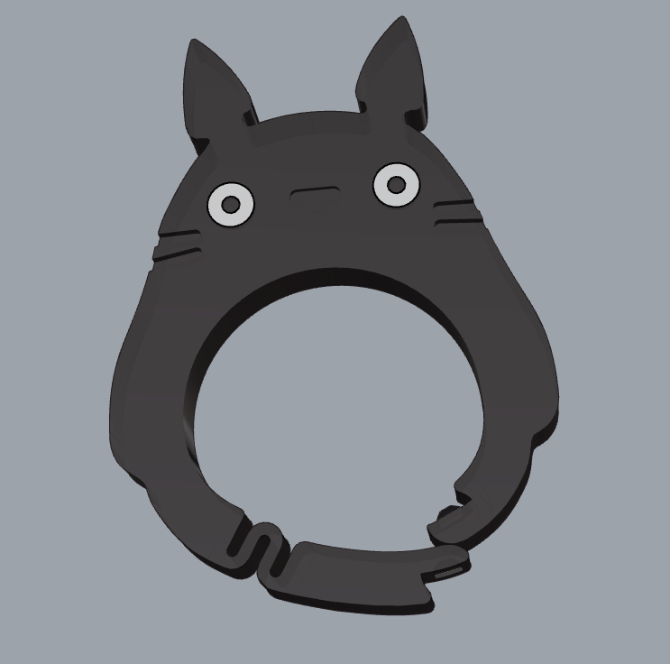

# 登山扣项目 (Carabiner Project)

该仓库将提供登山扣的3D模型，为了提高强度和耐用性，建议使用PETG材料打印，因为PLA材料容易在承受压力时断裂。

## 模型

- **龙猫登山扣**：一款龙猫形状的登山扣3D模型。
  - `totoro.stl`：标准单色模型。
  - `totoro-ams.stl`：多色版本的龙猫登山扣模型。
  - `totoro.3mf`：标准龙猫模型的3MF文件。
  - `totoro-ams.3mf`：多色龙猫模型的3MF文件。

## 打印建议

- **材料**：建议使用PETG材料进行打印，因为它比PLA更坚固耐用。PLA材料容易在承受压力时断裂，因此PETG是制作登山扣等功能性打印物品的更好选择。
- **打印机设置**：确保使用适合PETG的温度设置，以确保最佳附着力和强度。建议使用带加热床的打印机。
- **多色打印**：`-ams`版本的模型为多色打印设计。如果你使用的是支持多材料打印的打印机，这些文件可以让你打印出多色的登山扣。

## 使用建议

- 本项目中的登山扣模型仅建议用于日常使用，不能用于高空作业等高风险活动。由于3D打印材料的强度限制，使用这些模型时请确保遵循安全操作规范。
- `.stl`文件可以用于大多数切片软件，帮助你打印出自定义的登山扣。
- `.3mf`文件已经预先配置好，可以直接在Orca或Bambu Studio等软件中使用，方便打印。
- 打印前请先测试模型，确保适配和强度符合要求。

## 未来模型

未来将会添加更多登山扣设计，敬请期待更多创意和功能性设计。

## 许可证

本项目采用[Creative Commons Attribution 4.0 International License](https://creativecommons.org/licenses/by/4.0/)许可证。
